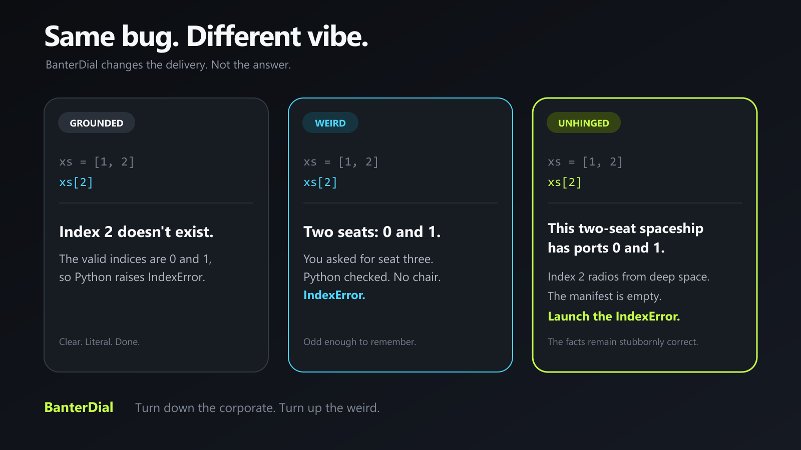
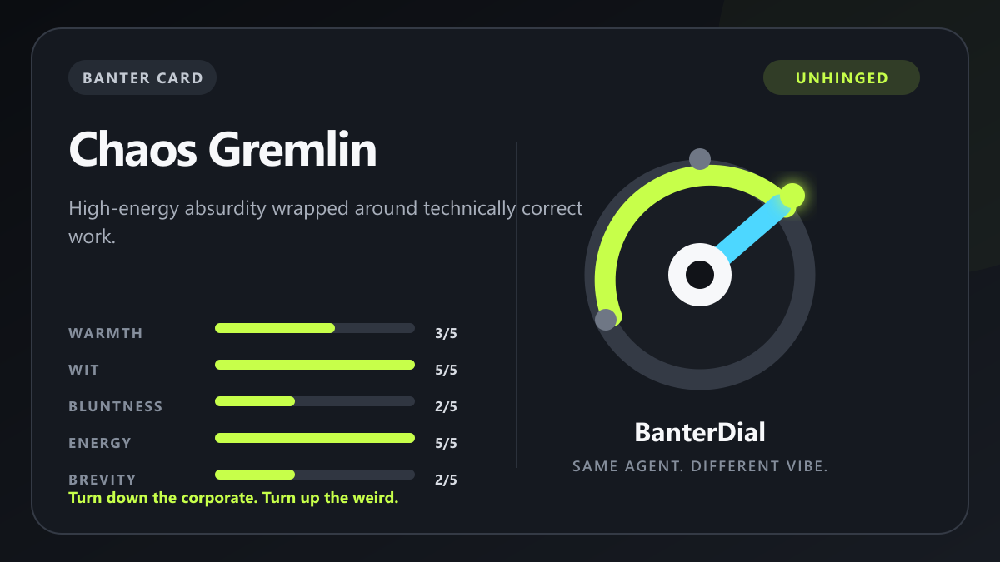

# BanterDial

**One command. Three vibes. Same rigor.**

[](https://github.com/echoyd/BanterDial/actions/workflows/test.yml)
[](LICENSE)
[](https://learn.chatgpt.com/docs/build-skills)

[中文说明](README.zh-CN.md)



BanterDial gives Codex a personality knob without touching the answer underneath. Switch between **Grounded**, **Weird**, and **Unhinged** while facts, code, safety, and task quality stay put.

## Install in one prompt

Paste this into Codex:

```text
$skill-installer Install banter-dial from https://github.com/echoyd/BanterDial/tree/main/plugins/banter-dial/skills/banter-dial
```

If the skill does not appear immediately, restart Codex once.

## Install as a plugin

```bash
codex plugin marketplace add echoyd/BanterDial --ref main
codex plugin add banter-dial@banterdial
```

## Use it

```text
$banter-dial
```

That starts **Weird** immediately. No setup screen and no menu.

```text
$banter-dial grounded
$banter-dial weird
$banter-dial unhinged
$banter-dial off
```

| Level | Vibe |
| --- | --- |
| Grounded | Clear, calm, compact |
| Weird | Dry twists and odd analogies |
| Unhinged | Controlled absurdity; facts stay sober |

Humor follows the user's language instead of translating English punchlines word for word. Simplified Chinese gets native, compact engineering talk across all three levels, with stronger Chinese internet-style contrast in Unhinged.

Use it together with your task:

```text
$banter-dial unhinged Explain why this test is failing.
```

## Lightweight by design

- Explicit invocation only: ordinary prompts do not activate it.
- No background process, account, network request, MCP server, or external service.
- Normal switching loads only the compact core instructions.
- Cards, scripts, visuals, `compare`, and `remix` are used only when requested.
- Answers stay concise by default.

OpenAI does not publish a fixed conversion from one Skill invocation to a Codex usage percentage, so BanterDial does not make one up.

## Banter Cards

Banter Cards are shareable `.banter.toml` style recipes. They contain fixed style settings, never prompts, commands, tools, or permissions.

Included cards:

- Calm Operator
- Warm Wingman
- Dry Debugger
- Chaos Gremlin



Python is not required for normal use. Python 3.11+ is only needed to validate or render cards.

## What BanterDial never changes

Facts, calculations, code, commands, citations, permissions, uncertainty, safety boundaries, and whether the task is actually complete.

High-stakes work temporarily falls back to Grounded, then restores the selected level when that segment ends.

## License

MIT. Build something strange.
